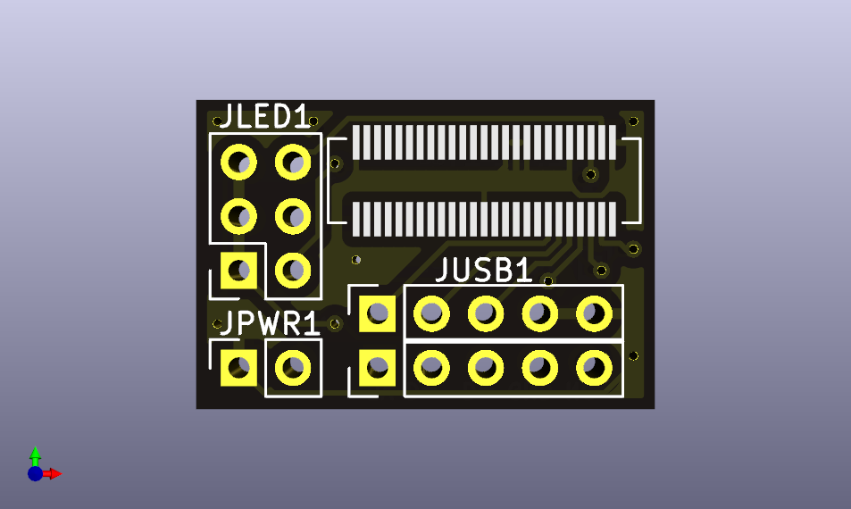

# Framework Laptop Input Cover Adapter

[![CC BY-NC-SA 4.0][cc-by-nc-sa-shield]][cc-by-nc-sa]

This is an Adapter-PCB for the [Keyboard-Input connector](https://github.com/FrameworkComputer/Framework-Laptop-13/blob/main/Electrical/Pinouts.md#input-cover-interface) on the 13" Framework Laptop.

It aims to create a more convenient way to Power up the Board compared to the small button on the PCB itself. It also has pins for a USB 2.0 connection, because why not?

This work is licensed under a
[Creative Commons Attribution-NonCommercial-ShareAlike 4.0 International License][cc-by-nc-sa].

[![CC BY-NC-SA 4.0][cc-by-nc-sa-image]][cc-by-nc-sa]

[cc-by-nc-sa]: http://creativecommons.org/licenses/by-nc-sa/4.0/
[cc-by-nc-sa-image]: https://licensebuttons.net/l/by-nc-sa/4.0/88x31.png
[cc-by-nc-sa-shield]: https://img.shields.io/badge/License-CC%20BY--NC--SA%204.0-lightgrey.svg
